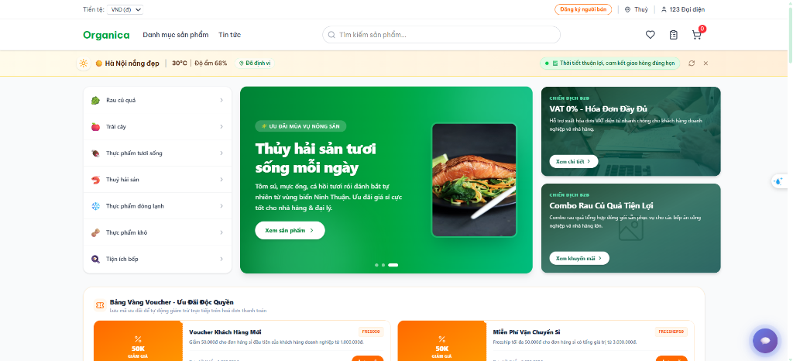
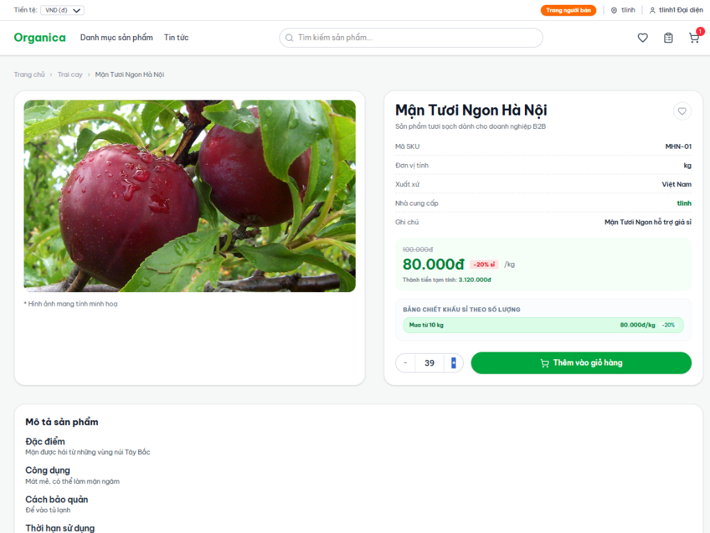
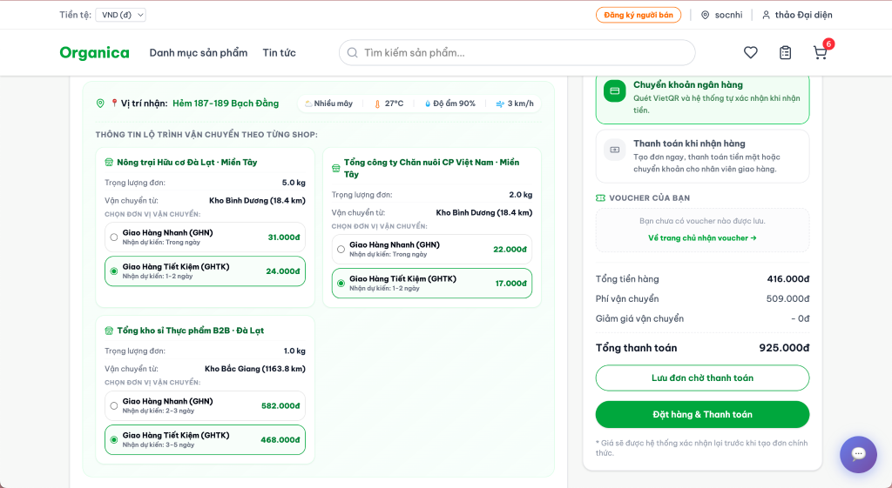
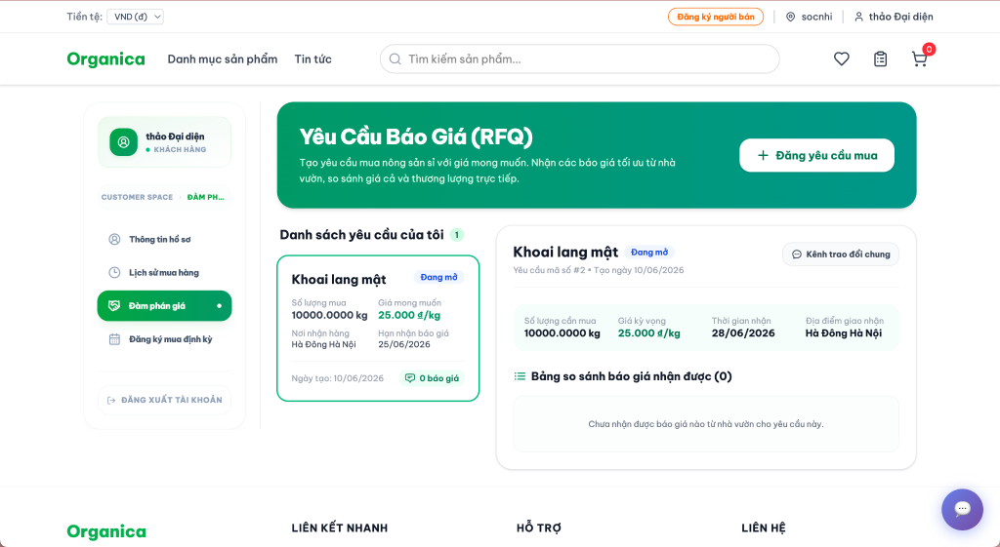
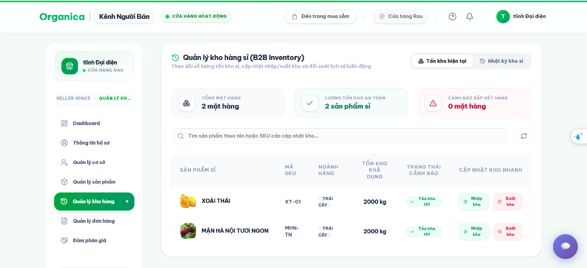

<div align="center">

# Organica — B2B Agricultural E-commerce Platform


Nền tảng thương mại điện tử B2B chuyên biệt cho ngành **nông sản Việt Nam**.  
Kiến trúc Headless: **Magento 2 backend** · **React 18 frontend** · **Google Gemini AI**

</div>

---

## Tổng quan

**Organica** phục vụ doanh nghiệp, đại lý và nhà phân phối đặt hàng nông sản số lượng lớn với đầy đủ nghiệp vụ B2B: đàm phán giá (RFQ), đặt hàng định kỳ, quản lý chi nhánh đa tầng và tư vấn mua hàng bằng AI.

---

## Kiến trúc hệ thống

```
React 18 + TypeScript (Vite)
        │  REST / GraphQL
Magento 2.4.8-p4  ·  PHP 8.4-FPM  ·  Nginx 1.24
   Custom Modules: Tmdt_Chatbot · Tmdt_Catalog · Tmdt_Registration · Tmdt_Search · Tmdt_Wishlist
        │
MariaDB 11.4  ·  Valkey/Redis 8.1  ·  OpenSearch 2.12  ·  RabbitMQ 4.1
        │
External APIs:
  Google Gemini  ·  GHN & GHTK  ·  Open-Meteo  ·  Vietcombank  ·  Nominatim/Leaflet  ·  VnExpress RSS
```

---

## Tính năng chính

| # | Tính năng | Mô tả |
|---|---|---|
| 🤖 | **Chatbot AI (RAG + Gemini)** | Tư vấn mua hàng tiếng Việt tự nhiên. Gemini phân tích ý định → truy vấn sản phẩm thật → sinh tư vấn hoàn chỉnh. Cache 2 tầng: Intent 10 phút + Reply 5 phút. Waterfall fallback model. |
| 🚚 | **Phí vận chuyển thông minh** | Tích hợp GHN & GHTK. Xác định kho gần nhất bằng Haversine. Phụ phí nhiệt độ > 35°C. Điều chỉnh ETA theo thời tiết thực (Open-Meteo). |
| 💬 | **RFQ — Đàm phán giá** | Buyer tạo yêu cầu báo giá → Seller phản hồi → Buyer chấp nhận. Thread nhắn tin nội bộ theo từng phiên. |
| 🔁 | **Đặt hàng định kỳ** | Tự động tạo đơn hàng theo chu kỳ tuần/tháng qua cron job. |
| 💱 | **Tỷ giá thời gian thực** | 6 loại tiền tệ (VND/USD/EUR/CNY/JPY/GBP) từ Vietcombank, cache 30 phút. Quy đổi giá tức thì phía client. |
| 📰 | **Tin tức nông sản** | Đồng bộ từ VnExpress & Báo Nông nghiệp VN. Waterfall proxy 3 tầng vượt CORS. Tự động phân loại 6 danh mục. |
| 👤 | **Tài khoản B2B đa tầng** | Đăng ký doanh nghiệp, phê duyệt admin, quản lý chi nhánh, thêm người dùng phụ. Google OAuth 2.0. |

---

## Giao diện hệ thống

### Trang chủ


### Chi tiết sản phẩm — Bảng chiết khấu sỉ theo số lượng


### Checkout — Tính phí vận chuyển GHN & GHTK theo kho + thời tiết


### Đàm phán giá — RFQ (Yêu Cầu Báo Giá)


### Quản lý kho hàng sỉ (Seller Dashboard)


---

## Tech Stack

| Layer | Công nghệ | Phiên bản |
|---|---|---|
| Backend | Magento Community Edition | 2.4.8-p4 |
| PHP Runtime | PHP-FPM | 8.4 |
| Web Server | Nginx | 1.24 |
| Frontend | React + TypeScript | 18.3.1 / 5.x |
| Build Tool | Vite | 6.x |
| UI Components | Radix UI + MUI + Tailwind CSS | latest |
| Animation | Motion (Framer Motion) | 12.x |
| Database | MariaDB | 11.4 |
| Cache / Queue | Valkey (Redis fork) | 8.1 |
| Search | OpenSearch | 2.12 |
| Message Queue | RabbitMQ | 4.1 |
| AI | Google Gemini API | gemini-2.5-flash |
| Container | Docker + Docker Compose | v2 |

---

## Yêu cầu hệ thống

- **Docker Engine** ≥ 24.0 + **Docker Compose** v2
- **RAM** ≥ 8 GB (khuyến nghị 16 GB)
- **Disk** ≥ 20 GB
- **OS**: Linux / macOS / Windows (WSL2)
- **Node.js** ≥ 20 (cho phát triển frontend)

---

## Cài đặt & Khởi chạy

```bash
# 1. Clone
git clone https://github.com/Manhndvinhyen/Ecommerce-B2B-system.git
cd Ecommerce-B2B-system

# 2. Cấu hình môi trường
make setup-env
# Điền GEMINI_API_KEY vào env/custom.env
# Điền thông tin admin vào env/magento.env

# 3. Khởi động containers
make start

# 4. Import database  (yêu cầu file dump/magento.sql.gz)
make setup-db

# 5. SSL (local)
make setup-ssl-ca && make setup-ssl magento.test

# 6. Deploy React Frontend
bin/deploy-react
```

### Truy cập

| Dịch vụ | URL |
|---|---|
| Cửa hàng B2B | https://magento.test |
| Magento Admin | https://magento.test/admin |
| MailCatcher | http://localhost:1080 |
| RabbitMQ | http://localhost:15672 |
| MariaDB | localhost:3307 |

---

## Cấu trúc dự án

```
Ecommerce-B2B-system/
├── src/
│   ├── app/code/Tmdt/     # 5 custom Magento modules
│   └── react-frontend/    # React 18 + TypeScript (Vite)
├── bin/                   # Docker helper scripts (~40 scripts)
├── env/                   # Biến môi trường
├── docs/                  # Tài liệu & screenshots
├── dump/                  # Database dumps
├── compose.yaml           # Docker Compose (dev)
├── compose.prod.yaml      # Docker Compose (prod)
└── Makefile
```

---

## Custom Magento Modules (`Tmdt_*`)

| Module | Trách nhiệm chính |
|---|---|
| `Tmdt_Chatbot` | Chatbot AI — RAG pipeline, intent/reply cache, Gemini waterfall fallback |
| `Tmdt_Catalog` | Quản lý sản phẩm sỉ, kho hàng, tỷ giá Vietcombank, thông báo seller |
| `Tmdt_Order` | Tạo & xử lý đơn hàng B2B, xác nhận thanh toán/nhận hàng, webhook SePay/VietQR, cron tự động hoàn thành đơn |
| `Tmdt_Promotion` | Quản lý khuyến mãi & voucher freeship, Admin UI, seed dữ liệu |
| `Tmdt_Recurring` | Đặt hàng định kỳ (tuần/tháng) — model đăng ký + cron tự động tạo đơn |
| `Tmdt_Rfq` | Đàm phán giá (RFQ): buyer tạo yêu cầu, seller báo giá, thread nhắn tin |
| `Tmdt_Registration` | Tài khoản: đăng nhập/đăng ký, Google OAuth, quản lý chi nhánh, OTP reset mật khẩu |
| `Tmdt_Search` | Tìm kiếm nâng cao, từ điển đồng nghĩa nông sản, keyword generator, lịch sử mua hàng |
| `Tmdt_Wishlist` | Danh sách yêu thích B2B |

---

## API Endpoints

> Prefix: `/rest` — ví dụ: `POST /rest/V1/chatbot/ask`

| Nhóm | Prefix |
|---|---|
| Chatbot AI | `/V1/chatbot/` |
| Catalog & Kho hàng | `/V1/tmdt-catalog/` |
| Đơn hàng & Vận chuyển | `/V1/tmdt-orders/` |
| Đặt hàng định kỳ | `/V1/tmdt-recurring/` |
| RFQ — Đàm phán giá | `/V1/tmdt-rfq/` |
| Tìm kiếm & Lịch sử | `/V1/tmdt-search/` |
| Wishlist | `/V1/tmdt/wishlist` |
| Tài khoản & Auth | `/V1/tmdt-registration/` |

---

## Lệnh Make phổ biến

```bash
make start / stop / restart    # Quản lý containers
make bash                      # Shell vào container app
make deploy                    # Static content + DI compile
make setup-db                  # Import database
make mysqldump                 # Backup database
make post-pull                 # Sau git pull: upgrade + cache:flush + deploy-react
make prod-deploy               # Pull & redeploy production
```

---

## Biến môi trường quan trọng

| File | Biến | Mô tả |
|---|---|---|
| `env/custom.env` | `GEMINI_API_KEY` | **[Bắt buộc]** Google Gemini API Key |
| `env/magento.env` | `MAGENTO_ADMIN_USER/PASSWORD/EMAIL` | Thông tin admin Magento |
| `env/magento.env` | `MAGENTO_BASE_URL` | URL cửa hàng (mặc định: `https://magento.test/`) |
| `env/db.env` | `MYSQL_ROOT_PASSWORD`, `MYSQL_DATABASE` | Cấu hình database |

---

## Tài liệu thêm

- [`tai_lieu_phan_tich_thiet_ke.md`](./docs/tai_lieu_phan_tich_thiet_ke.md) — Phân tích & thiết kế hệ thống + Sequence Diagrams
- [`CHATBOT_AI_DOCS.md`](./docs/CHATBOT_AI_DOCS.md) — Kỹ thuật Chatbot AI (RAG, Cache, Fallback)
- [`README_MAGENTO.md`](./src/react-frontend/README_MAGENTO.md) — Tích hợp React với Magento

---

## License

Magento Community Edition — [OSL-3.0](./src/LICENSE.txt) & [AFL-3.0](./src/LICENSE_AFL.txt).  
Code tùy chỉnh (`Tmdt/*`) và React Frontend thuộc sở hữu nhóm phát triển.

<div align="center">

**Được xây dựng với ❤️ cho nông sản Việt Nam** 🌾

</div>

