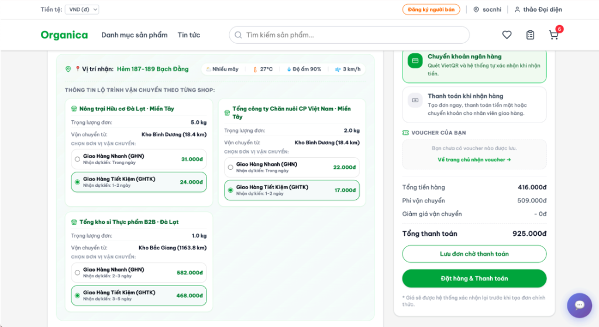

<div align="center">

# Organica — B2B Agricultural E-commerce Platform


Nền tảng thương mại điện tử B2B chuyên biệt cho ngành **nông sản Việt Nam**.  
Kiến trúc Headless: **Magento 2 backend** · **React 18 frontend** · **Google Gemini AI**

</div>

---

## Tổng quan

**Organica** phục vụ doanh nghiệp, đại lý và nhà phân phối đặt hàng nông sản số lượng lớn với đầy đủ nghiệp vụ B2B: đàm phán giá (RFQ), đặt hàng định kỳ, quản lý chi nhánh đa tầng và tư vấn mua hàng bằng AI.

---

## Kiến trúc hệ thống

```
React 18 + TypeScript (Vite)
        │  REST / GraphQL
Magento 2.4.8-p4  ·  PHP 8.4-FPM  ·  Nginx 1.24
   Custom Modules: Tmdt_Chatbot · Tmdt_Catalog · Tmdt_Registration · Tmdt_Search · Tmdt_Wishlist
        │
MariaDB 11.4  ·  Valkey/Redis 8.1  ·  OpenSearch 2.12  ·  RabbitMQ 4.1
        │
External APIs:
  Google Gemini  ·  GHN & GHTK  ·  Open-Meteo  ·  Vietcombank  ·  Nominatim/Leaflet  ·  VnExpress RSS
```

---

## Tính năng chính

| # | Tính năng | Mô tả |
|---|---|---|
| 🤖 | **Chatbot AI (RAG + Gemini)** | Tư vấn mua hàng tiếng Việt tự nhiên. Gemini phân tích ý định → truy vấn sản phẩm thật → sinh tư vấn hoàn chỉnh. Cache 2 tầng: Intent 10 phút + Reply 5 phút. Waterfall fallback model. |
| 🚚 | **Phí vận chuyển thông minh** | Tích hợp GHN & GHTK. Xác định kho gần nhất bằng Haversine. Phụ phí nhiệt độ > 35°C. Điều chỉnh ETA theo thời tiết thực (Open-Meteo). |
| 💬 | **RFQ — Đàm phán giá** | Buyer tạo yêu cầu báo giá → Seller phản hồi → Buyer chấp nhận. Thread nhắn tin nội bộ theo từng phiên. |
| 🔁 | **Đặt hàng định kỳ** | Tự động tạo đơn hàng theo chu kỳ tuần/tháng qua cron job. |
| 💱 | **Tỷ giá thời gian thực** | 6 loại tiền tệ (VND/USD/EUR/CNY/JPY/GBP) từ Vietcombank, cache 30 phút. Quy đổi giá tức thì phía client. |
| 📰 | **Tin tức nông sản** | Đồng bộ từ VnExpress & Báo Nông nghiệp VN. Waterfall proxy 3 tầng vượt CORS. Tự động phân loại 6 danh mục. |
| 👤 | **Tài khoản B2B đa tầng** | Đăng ký doanh nghiệp, phê duyệt admin, quản lý chi nhánh, thêm người dùng phụ. Google OAuth 2.0. |

---

## Giao diện hệ thống

### Trang chủ


### Chi tiết sản phẩm


### Thanh toán & Tóm tắt đơn hàng


### Tính phí vận chuyển + Thời tiết thực


### Quản lý kho hàng (Seller Dashboard)


---

## Tech Stack

| Layer | Công nghệ | Phiên bản |
|---|---|---|
| Backend | Magento Community Edition | 2.4.8-p4 |
| PHP Runtime | PHP-FPM | 8.4 |
| Web Server | Nginx | 1.24 |
| Frontend | React + TypeScript | 18.3.1 / 5.x |
| Build Tool | Vite | 6.x |
| UI Components | Radix UI + MUI + Tailwind CSS | latest |
| Animation | Motion (Framer Motion) | 12.x |
| Database | MariaDB | 11.4 |
| Cache / Queue | Valkey (Redis fork) | 8.1 |
| Search | OpenSearch | 2.12 |
| Message Queue | RabbitMQ | 4.1 |
| AI | Google Gemini API | gemini-2.5-flash |
| Container | Docker + Docker Compose | v2 |

---

## Yêu cầu hệ thống

- **Docker Engine** ≥ 24.0 + **Docker Compose** v2
- **RAM** ≥ 8 GB (khuyến nghị 16 GB)
- **Disk** ≥ 20 GB
- **OS**: Linux / macOS / Windows (WSL2)
- **Node.js** ≥ 20 (cho phát triển frontend)

---

## Cài đặt & Khởi chạy

```bash
# 1. Clone
git clone https://github.com/Manhndvinhyen/Ecommerce-B2B-system.git
cd Ecommerce-B2B-system

# 2. Cấu hình môi trường
make setup-env
# Điền GEMINI_API_KEY vào env/custom.env
# Điền thông tin admin vào env/magento.env

# 3. Khởi động containers
make start

# 4. Import database  (yêu cầu file dump/magento.sql.gz)
make setup-db

# 5. SSL (local)
make setup-ssl-ca && make setup-ssl magento.test

# 6. Deploy React Frontend
bin/deploy-react
```

### Truy cập

| Dịch vụ | URL |
|---|---|
| Cửa hàng B2B | https://magento.test |
| Magento Admin | https://magento.test/admin |
| MailCatcher | http://localhost:1080 |
| RabbitMQ | http://localhost:15672 |
| MariaDB | localhost:3307 |

---

## Cấu trúc dự án

```
Ecommerce-B2B-system/
├── src/
│   ├── app/code/Tmdt/     # 5 custom Magento modules
│   └── react-frontend/    # React 18 + TypeScript (Vite)
├── bin/                   # Docker helper scripts (~40 scripts)
├── env/                   # Biến môi trường
├── docs/                  # Tài liệu & screenshots
├── dump/                  # Database dumps
├── compose.yaml           # Docker Compose (dev)
├── compose.prod.yaml      # Docker Compose (prod)
└── Makefile
```

---

## Custom Magento Modules (`Tmdt_*`)

| Module | Trách nhiệm chính |
|---|---|
| `Tmdt_Chatbot` | Chatbot AI — RAG pipeline, intent/reply cache, Gemini waterfall fallback |
| `Tmdt_Catalog` | Nghiệp vụ B2B: sản phẩm, kho hàng, đơn hàng, RFQ, đặt hàng định kỳ, tỷ giá, khuyến mãi |
| `Tmdt_Registration` | Tài khoản: đăng nhập/đăng ký, Google OAuth, quản lý chi nhánh, OTP reset mật khẩu |
| `Tmdt_Search` | Tìm kiếm nâng cao, từ điển đồng nghĩa nông sản, lịch sử mua hàng |
| `Tmdt_Wishlist` | Danh sách yêu thích B2B |

---

## API Endpoints

> Prefix: `/rest` — ví dụ: `POST /rest/V1/chatbot/ask`

| Nhóm | Prefix |
|---|---|
| Chatbot AI | `/V1/chatbot/` |
| Catalog & Kho hàng | `/V1/tmdt-catalog/` |
| Đơn hàng & Vận chuyển | `/V1/tmdt-orders/` |
| Đặt hàng định kỳ | `/V1/tmdt-recurring/` |
| RFQ — Đàm phán giá | `/V1/tmdt-rfq/` |
| Tìm kiếm & Lịch sử | `/V1/tmdt-search/` |
| Wishlist | `/V1/tmdt/wishlist` |
| Tài khoản & Auth | `/V1/tmdt-registration/` |

---

## Lệnh Make phổ biến

```bash
make start / stop / restart    # Quản lý containers
make bash                      # Shell vào container app
make deploy                    # Static content + DI compile
make setup-db                  # Import database
make mysqldump                 # Backup database
make post-pull                 # Sau git pull: upgrade + cache:flush + deploy-react
make prod-deploy               # Pull & redeploy production
```

---

## Biến môi trường quan trọng

| File | Biến | Mô tả |
|---|---|---|
| `env/custom.env` | `GEMINI_API_KEY` | **[Bắt buộc]** Google Gemini API Key |
| `env/magento.env` | `MAGENTO_ADMIN_USER/PASSWORD/EMAIL` | Thông tin admin Magento |
| `env/magento.env` | `MAGENTO_BASE_URL` | URL cửa hàng (mặc định: `https://magento.test/`) |
| `env/db.env` | `MYSQL_ROOT_PASSWORD`, `MYSQL_DATABASE` | Cấu hình database |

---

## Tài liệu thêm

- [`tai_lieu_phan_tich_thiet_ke.md`](./docs/tai_lieu_phan_tich_thiet_ke.md) — Phân tích & thiết kế hệ thống + Sequence Diagrams
- [`CHATBOT_AI_DOCS.md`](./docs/CHATBOT_AI_DOCS.md) — Kỹ thuật Chatbot AI (RAG, Cache, Fallback)
- [`README_MAGENTO.md`](./src/react-frontend/README_MAGENTO.md) — Tích hợp React với Magento

---

## License

Magento Community Edition — [OSL-3.0](./src/LICENSE.txt) & [AFL-3.0](./src/LICENSE_AFL.txt).  
Code tùy chỉnh (`Tmdt/*`) và React Frontend thuộc sở hữu nhóm phát triển.

<div align="center">

**Được xây dựng với ❤️ cho nông sản Việt Nam** 🌾

</div>

<div align="center">


**Nền tảng B2B chuyên biệt cho ngành nông sản Việt Nam**  
Kết hợp Magento 2 Headless + React Frontend + Google Gemini AI

</div>

---

## 📋 Mục lục

- [Tổng quan](#-tổng-quan)
- [Kiến trúc hệ thống](#-kiến-trúc-hệ-thống)
- [Tính năng nổi bật](#-tính-năng-nổi-bật)
- [Giao diện hệ thống](#-giao-diện-hệ-thống)
- [Công nghệ sử dụng](#-công-nghệ-sử-dụng)
- [Yêu cầu hệ thống](#-yêu-cầu-hệ-thống)
- [Cài đặt & Khởi chạy](#-cài-đặt--khởi-chạy)
- [Cấu trúc dự án](#-cấu-trúc-dự-án)
- [Các Module tùy chỉnh (Magento)](#-các-module-tùy-chỉnh-magento)
- [API Endpoints](#-api-endpoints)
- [Lệnh Make hữu ích](#-lệnh-make-hữu-ích)
- [Biến môi trường](#-biến-môi-trường)
- [Luồng hoạt động chính](#-luồng-hoạt-động-chính)

---

## 🌾 Tổng quan

**Organica** là hệ thống thương mại điện tử B2B chuyên biệt cho ngành **nông sản Việt Nam**, được thiết kế theo mô hình **Decoupled/Headless**:

- Khách hàng sỉ (doanh nghiệp, đại lý, nhà phân phối) có thể đặt hàng nông sản số lượng lớn.
- Tự động tính phí vận chuyển thực tế dựa trên khoảng cách địa lý và thời tiết thời gian thực.
- Chatbot AI tư vấn mua hàng thông minh bằng ngôn ngữ tự nhiên (tiếng Việt).
- Hiển thị tin tức thị trường nông sản cập nhật từ nhiều nguồn RSS.
- Hỗ trợ quy đổi giá linh hoạt theo 6 loại ngoại tệ (VND, USD, EUR, CNY, JPY, GBP).

---

## 🏗 Kiến trúc hệ thống

```
┌─────────────────────────────────────────────────────────────────┐
│                        CLIENT BROWSER                           │
│   React 18 + TypeScript + Vite (Headless Frontend)              │
│   Radix UI · MUI · Tailwind CSS · Leaflet Map                   │
└────────────────────────┬────────────────────────────────────────┘
                         │ REST / GraphQL API
┌────────────────────────▼────────────────────────────────────────┐
│                    MAGENTO 2.4.8-p4 BACKEND                     │
│   PHP 8.4-FPM · Nginx 1.24 · Custom Modules (Tmdt/*)           │
│   ┌──────────────┐ ┌──────────────┐ ┌──────────────────────┐   │
│   │ Tmdt_Chatbot │ │ Tmdt_Catalog │ │ Tmdt_Registration    │   │
│   │ Tmdt_Search  │ │ Tmdt_Orders  │ │ Tmdt_Wishlist        │   │
│   └──────────────┘ └──────────────┘ └──────────────────────┘   │
└──────────┬─────────────────┬──────────────────┬─────────────────┘
           │                 │                  │
┌──────────▼──────┐ ┌────────▼────────┐ ┌──────▼──────────────────┐
│  MariaDB 11.4   │ │  Valkey/Redis   │ │  OpenSearch 2.12        │
│  (Database)     │ │  (Cache/Queue)  │ │  (Full-text Search)     │
└─────────────────┘ └─────────────────┘ └─────────────────────────┘
           │
┌──────────▼──────────────────────────────────────────────────────┐
│                   DỊCH VỤ TÍCH HỢP BÊN NGOÀI                   │
│  🤖 Google Gemini API     — Chatbot AI tư vấn nông sản          │
│  🗺 OpenStreetMap/Nominatim — Geocoding & Bản đồ Leaflet        │
│  🌤 Open-Meteo API        — Thời tiết thời gian thực            │
│  💱 Vietcombank API       — Tỷ giá ngoại tệ cập nhật tự động   │
│  📰 VnExpress RSS / Báo Nông nghiệp VN — Tin tức thị trường    │
│  🚚 GHN & GHTK            — Tính phí vận chuyển                │
└─────────────────────────────────────────────────────────────────┘
```

---

## ✨ Tính năng nổi bật

### 🤖 Chatbot AI tư vấn nông sản (RAG + Gemini)
- Hiểu câu hỏi tự nhiên tiếng Việt: *"Tôi muốn nấu canh chua cần mua gì?"*
- **LLM-Expanded Keyword Search**: Gemini phân tích ý định → trích xuất tên sản phẩm + khoảng giá.
- **RAG (Retrieval-Augmented Generation)**: Tìm sản phẩm thật trong database → đưa vào context → Gemini viết tư vấn hoàn chỉnh.
- **Cache 2 tầng**: Intent cache (10 phút) + Reply cache (5 phút) → phản hồi < 50ms cho câu hỏi trùng lặp.
- **Waterfall Fallback Model**: `gemini-2.5-flash` → `gemini-2.5-flash-lite` → `gemini-2.0-flash-lite`.

### 🚚 Tính phí vận chuyển thông minh theo thời tiết
- Định vị GPS hoặc chọn địa chỉ trên bản đồ Leaflet tích hợp.
- Xác định kho hàng gần nhất bằng công thức khoảng cách **Haversine**.
- Tích hợp **GHN** (Giao Hàng Nhanh) và **GHTK** (Giao Hàng Tiết Kiệm) với cước phí thực tế.
- Phụ phí bảo quản lạnh **+10.000đ** khi nhiệt độ > 35°C.
- Điều chỉnh ETA tự động theo mưa/gió (hệ số 1.2x đến 3.0x).
- Hỗ trợ voucher miễn phí vận chuyển tối đa 200.000đ.

### 📰 Tin tức nông sản (RSS Proxy Waterfall)
- Đồng bộ từ **VnExpress** và **Báo Nông nghiệp Việt Nam**.
- Chiến lược **Waterfall Proxy 3 tầng** vượt rào cản CORS: Local PHP Proxy → AllOrigins API → CorsProxy.io.
- Phân loại tự động vào 6 danh mục: *Giá cả & Thị trường, Xuất nhập khẩu, Nông nghiệp, Logistics, Thủy hải sản, Trái cây & Rau củ*.
- Cache client-side 30 phút (`localStorage`).

### 💱 Quy đổi tiền tệ thời gian thực
- 6 loại tiền tệ: **VND, USD, EUR, CNY, JPY, GBP**.
- Tỷ giá cập nhật tự động từ **Vietcombank** (cache 30 phút phía server).
- Quy đổi giá động tức thì ở phía client — không cần reload trang.

### 🛒 Quản lý đơn hàng B2B
- Hỗ trợ đơn vị đặt hàng sỉ nông sản: kg, bao (30kg), yến (10kg), tạ (100kg), thùng (10kg), khay/hộp (0.5kg).
- Quản lý Wishlist theo nhóm khách hàng sỉ.
- Đăng ký tài khoản B2B với phê duyệt doanh nghiệp.

---

## 📸 Một số giao diện hệ thống

### Trang chủ — Homepage B2B


### Trang chi tiết sản phẩm


### Tóm tắt đơn hàng — Checkout


### Tính phí vận chuyển + Thời tiết thời gian thực


### Kênh người bán — Quản lý kho hàng sỉ (B2B Inventory)


---

## 🛠 Công nghệ sử dụng

| Layer | Công nghệ | Phiên bản |
|---|---|---|
| **Backend** | Magento Community Edition | 2.4.8-p4 |
| **Runtime PHP** | PHP-FPM | 8.4 |
| **Web Server** | Nginx | 1.24 |
| **Frontend** | React + TypeScript | 18.3.1 / 5.x |
| **Build Tool** | Vite | 6.x |
| **UI Components** | Radix UI + MUI + Tailwind CSS | latest |
| **Animation** | Motion (Framer Motion) | 12.x |
| **Database** | MariaDB | 11.4 |
| **Cache/Queue** | Valkey (Redis fork) | 8.1 |
| **Search Engine** | OpenSearch | 2.12 |
| **Message Queue** | RabbitMQ | 4.1 |
| **AI** | Google Gemini API | gemini-2.5-flash |
| **Containerization** | Docker + Docker Compose | v2 |
| **Mail (Dev)** | MailCatcher | 0.10 |

---

## 💻 Yêu cầu hệ thống

- **Docker Engine** ≥ 24.0 và **Docker Compose** v2
- **RAM** tối thiểu 8GB (khuyến nghị 16GB)
- **Disk** tối thiểu 20GB trống
- **OS**: Linux / macOS / Windows (WSL2)
- **Node.js** ≥ 20 + **npm** (cho development frontend)

---

## 🚀 Cài đặt & Khởi chạy

### 1. Clone dự án

```bash
git clone https://github.com/Manhndvinhyen/Ecommerce-B2B-system.git
cd Ecommerce-B2B-system
```

### 2. Cấu hình môi trường

```bash
make setup-env
```

Lệnh này sẽ tạo các file cấu hình mẫu. Sau đó chỉnh sửa:

```bash
# ⚠️ BẮT BUỘC: Điền Google Gemini API Key
nano env/custom.env

# ⚠️ BẮT BUỘC: Điền thông tin admin Magento
nano env/magento.env
```

**Nội dung `env/custom.env` quan trọng:**
```env
GEMINI_API_KEY=your_google_gemini_api_key_here
```

### 3. Khởi động containers

```bash
make start
```

### 4. Import database

```bash
# Đảm bảo file dump/magento.sql.gz tồn tại
make setup-db
```

### 5. Thiết lập SSL (local development)

```bash
make setup-ssl-ca
make setup-ssl magento.test
```

### 6. Deploy React Frontend

```bash
bin/deploy-react
```

### 7. Truy cập hệ thống

| Dịch vụ | URL |
|---|---|
| **Cửa hàng B2B** | https://magento.test |
| **Admin Magento** | https://magento.test/admin |
| **MailCatcher** | http://localhost:1080 |
| **RabbitMQ Management** | http://localhost:15672 |
| **OpenSearch** | http://localhost:9201 |
| **MariaDB** | localhost:3307 |

---

## 📁 Cấu trúc dự án

```
Ecommerce-B2B-system/
├── src/                    # Magento 2 backend (PHP)
│   ├── app/code/Tmdt/      # Custom modules: Chatbot, Catalog, Search...
│   ├── react-frontend/     # React 18 + TypeScript frontend (Vite)
│   ├── pub/                # Web root
│   └── nginx.conf
├── bin/                    # Docker helper scripts (~40 scripts)
├── env/                    # Biến môi trường (db, magento, redis...)
├── docs/                   # Tài liệu & screenshots
├── dump/                   # Database dumps
├── compose.yaml            # Docker Compose (dev)
├── compose.prod.yaml       # Docker Compose (prod)
└── Makefile                # Shortcut cho bin/ scripts
```


---

## 🔧 Các Module tùy chỉnh (Magento)

> Dự án có **5 module Magento** đăng ký chính thức (`Tmdt_*`). Bên trong `Tmdt_Catalog` chứa nhiều **domain tính năng lớn** được tổ chức theo từng `Management` class riêng biệt: Sản phẩm, Đơn hàng, Kho hàng, Đặt hàng định kỳ, Đàm phán giá (RFQ), Khuyến mãi, Tỷ giá, Thanh toán.

---

### 🤖 `Tmdt_Chatbot` — Chatbot AI tư vấn
> **Phụ thuộc**: `Tmdt_Search`, `Magento_Catalog`

| Thành phần | Mô tả |
|---|---|
| `ChatbotManagement` | Nhận câu hỏi → gọi Gemini → multi-keyword SQL search → RAG → trả lời |
| Cache 2 tầng | Intent cache 10 phút + Reply cache 5 phút (Redis/File) |
| Waterfall Fallback | `gemini-2.5-flash` → `gemini-2.5-flash-lite` → `gemini-2.0-flash-lite` |

---

### 📦 `Tmdt_Catalog` — Nghiệp vụ B2B chính
> **Phụ thuộc**: `Magento_Catalog`, `Magento_CatalogInventory`, `Tmdt_Registration`

**🛒 Sản phẩm & Kho hàng**

| Thành phần | Mô tả |
|---|---|
| `ProductManagement` | CRUD sản phẩm sỉ (tạo/sửa/xóa theo SKU) |
| `InventoryManagement` | Nhập/xuất kho, lịch sử tồn kho, cảnh báo sắp hết hàng |
| `PromotionManagement` | Quản lý khuyến mãi B2B, voucher freeship |
| `Rates` | Lấy tỷ giá Vietcombank (XML → JSON, cache 30 phút) |

**📋 Đơn hàng & Thanh toán**

| Thành phần | Mô tả |
|---|---|
| `OrderManagement` | Tạo đơn hàng, cập nhật trạng thái, xác nhận thanh toán/nhận hàng |
| `OrderProcessor` | Xử lý nội bộ luồng đơn hàng B2B |
| `AutoCompleteOrders` *(Cron)* | Tự động hoàn thành đơn hàng quá hạn |
| `Sepay` *(Webhook)* | Nhận webhook thanh toán từ SePay/VietQR |

**🔁 Đặt hàng định kỳ (Recurring Orders)**

| Thành phần | Mô tả |
|---|---|
| `Recurring` | Model đặt hàng tự động theo chu kỳ (hàng tuần/tháng) |
| `ProcessRecurringOrders` *(Cron)* | Cron job tự động tạo đơn hàng khi đến kỳ |

**💬 Đàm phán giá — RFQ (Request for Quotation)**

| Thành phần | Mô tả |
|---|---|
| `RfqManagement` | Buyer tạo yêu cầu báo giá → Seller phản hồi → Buyer chấp nhận |
| Thread nhắn tin | Buyer và Seller trao đổi trong từng phiên RFQ |

---

### 👤 `Tmdt_Registration` — Tài khoản & Chi nhánh B2B
> **Phụ thuộc**: `Magento_Backend`, `Magento_Customer`, `Magento_Integration`, `Magento_Webapi`

| Thành phần | Mô tả |
|---|---|
| `LoginManagement` | Đăng nhập email/mật khẩu, trả về token |
| `GoogleLoginManagement` | Đăng nhập Google OAuth 2.0 |
| `RegisterManagement` | Đăng ký tài khoản B2B (buyer/seller) |
| `ForgotPasswordRequestOtpManagement` | Gửi OTP qua email để đặt lại mật khẩu |
| `ForgotPasswordResetManagement` | Đặt lại mật khẩu bằng OTP |
| `ProfileViewManagement` / `ProfileUpdateManagement` | Xem và cập nhật hồ sơ doanh nghiệp |
| `AddUsersManagement` | Thêm người dùng phụ cho cùng doanh nghiệp |
| `BranchManagerListManagement` | Danh sách quản lý chi nhánh |
| `BranchManagerUpdateManagement` / `BranchManagerDeleteManagement` | Cập nhật / xóa quản lý chi nhánh |
| `BranchPerformanceManagement` | Thống kê hiệu suất theo chi nhánh |
| Customer Attributes | Thêm field `tmdt_role`, `is_owner`, `is_super_admin` vào Magento Customer |
| `Approve` / `Reject` *(Admin)* | Duyệt/từ chối đăng ký tài khoản B2B từ Admin Panel |

---

### 🔍 `Tmdt_Search` — Tìm kiếm & Lịch sử mua hàng
> **Phụ thuộc**: `Magento_Catalog`, `Magento_CatalogSearch`

| Thành phần | Mô tả |
|---|---|
| `ProductSearchManagement` | Tìm kiếm sản phẩm nâng cao theo từ khóa + bộ lọc |
| `ProductKeywordGenerator` | Tự động sinh keyword tìm kiếm cho từng sản phẩm |
| `SearchDictionary` | Từ điển từ đồng nghĩa ngành nông sản |
| `ProductRetrievalService` | Service truy xuất sản phẩm theo keyword (dùng chung với Chatbot) |
| `GenerateProductKeywordsObserver` | Observer tự động cập nhật keyword khi sản phẩm thay đổi |
| `PurchaseHistoryManagement` | Lưu và truy vấn lịch sử mua hàng theo tài khoản |
| `RegenerateProductKeywordsCommand` | Console command tái tạo keyword hàng loạt |
| Product Attribute | Thêm attribute `search_keywords` vào Magento Product |

---

### ❤️ `Tmdt_Wishlist` — Danh sách yêu thích

| Thành phần | Mô tả |
|---|---|
| `WishlistManagement` | CRUD danh sách yêu thích (tạo list, thêm/xóa sản phẩm) |
| `WishlistList` / `WishlistItem` | Data model cho wishlist và từng item |
| DB Collection | ORM collection truy vấn wishlist theo tài khoản |

---

## 🌐 API Endpoints

> Tất cả endpoint có prefix `/rest` — ví dụ: `POST /rest/V1/chatbot/ask`

### 🤖 Chatbot AI
| Method | Endpoint | Mô tả |
|---|---|---|
| `POST` | `/V1/chatbot/ask` | Hỏi chatbot AI tư vấn nông sản (Gemini RAG) |

### 📦 Catalog & Kho hàng (Seller)
| Method | Endpoint | Mô tả |
|---|---|---|
| `GET` | `/V1/tmdt-catalog/products` | Lấy danh sách sản phẩm sỉ |
| `POST` | `/V1/tmdt-catalog/product` | Tạo sản phẩm mới |
| `PUT` | `/V1/tmdt-catalog/product/:sku` | Cập nhật sản phẩm theo SKU |
| `DELETE` | `/V1/tmdt-catalog/product/:sku` | Xóa sản phẩm theo SKU |
| `POST` | `/V1/tmdt-catalog/inventory/adjust` | Nhập/xuất kho (điều chỉnh tồn kho) |
| `GET` | `/V1/tmdt-catalog/inventory/logs` | Lịch sử nhập/xuất kho |
| `GET` | `/V1/tmdt-catalog/suppliers` | Danh sách nhà cung cấp |
| `GET` | `/V1/tmdt-catalog/promotions` | Danh sách khuyến mãi đang áp dụng |
| `GET` | `/V1/tmdt-catalog/revenue` | Doanh thu theo kỳ (dashboard seller) |
| `GET` | `/V1/tmdt-catalog/orders` | Đơn hàng của seller |
| `GET` | `/V1/tmdt-catalog/rates` | Tỷ giá ngoại tệ (Vietcombank, cache 30 phút) |
| `GET` | `/V1/tmdt-catalog/notifications` | Thông báo của seller |
| `POST` | `/V1/tmdt-catalog/notifications/read` | Đánh dấu thông báo đã đọc |

### 🚚 Đơn hàng & Vận chuyển
| Method | Endpoint | Mô tả |
|---|---|---|
| `POST` | `/V1/tmdt-orders/create` | Tạo đơn hàng B2B mới |
| `GET` | `/V1/tmdt-orders/status/:orderCode` | Kiểm tra trạng thái đơn hàng |
| `GET` | `/V1/tmdt-orders/warehouses` | Danh sách kho hàng & tọa độ (tính phí ship) |
| `POST` | `/V1/tmdt-orders/confirm-payment` | Xác nhận thanh toán |
| `POST` | `/V1/tmdt-orders/confirm-receipt` | Xác nhận đã nhận hàng |
| `POST` | `/V1/tmdt-orders/update-fulfillment` | Cập nhật trạng thái giao hàng |

### 🔁 Đặt hàng định kỳ (Recurring)
| Method | Endpoint | Mô tả |
|---|---|---|
| `POST` | `/V1/tmdt-recurring/subscribe` | Đăng ký đặt hàng tự động định kỳ |
| `GET` | `/V1/tmdt-recurring/list` | Danh sách đơn hàng định kỳ |
| `POST` | `/V1/tmdt-recurring/cancel` | Hủy đặt hàng định kỳ |

### 💬 Đàm phán giá — RFQ (Request for Quotation)
| Method | Endpoint | Mô tả |
|---|---|---|
| `POST` | `/V1/tmdt-rfq/create` | Tạo yêu cầu báo giá mới |
| `GET` | `/V1/tmdt-rfq/buyer-list` | Danh sách RFQ của buyer |
| `GET` | `/V1/tmdt-rfq/open-list` | Danh sách RFQ đang mở (cho seller) |
| `POST` | `/V1/tmdt-rfq/quote/submit` | Seller gửi báo giá |
| `GET` | `/V1/tmdt-rfq/quotes/:rfqId` | Xem các báo giá của một RFQ |
| `GET` | `/V1/tmdt-rfq/seller-quotes` | Tất cả báo giá của seller |
| `POST` | `/V1/tmdt-rfq/quote/accept` | Buyer chấp nhận báo giá |
| `POST` | `/V1/tmdt-rfq/message/add` | Gửi tin nhắn trong thread RFQ |
| `GET` | `/V1/tmdt-rfq/messages/:rfqId` | Lịch sử tin nhắn RFQ |

### 🔍 Tìm kiếm & Lịch sử
| Method | Endpoint | Mô tả |
|---|---|---|
| `GET` | `/V1/tmdt-search/products` | Tìm kiếm sản phẩm nâng cao |
| `GET` | `/V1/tmdt-search/purchase-history` | Lịch sử mua hàng của tài khoản |
| `POST` | `/V1/tmdt-search/purchase-history` | Lưu lịch sử mua hàng sau checkout |

### ❤️ Wishlist
| Method | Endpoint | Mô tả |
|---|---|---|
| `GET` | `/V1/tmdt/wishlist` | Lấy tất cả wishlist |
| `GET` | `/V1/tmdt/wishlist/:listId` | Xem chi tiết một wishlist |
| `POST` | `/V1/tmdt/wishlist` | Tạo wishlist mới |
| `POST` | `/V1/tmdt/wishlist/item` | Thêm sản phẩm vào wishlist |
| `DELETE` | `/V1/tmdt/wishlist/item/:itemId` | Xóa sản phẩm khỏi wishlist |

### 👤 Tài khoản & Xác thực
| Method | Endpoint | Mô tả |
|---|---|---|
| `POST` | `/V1/tmdt-registration/login` | Đăng nhập |
| `POST` | `/V1/tmdt-registration/google-login` | Đăng nhập Google OAuth |
| `POST` | `/V1/tmdt-registration/register` | Đăng ký tài khoản B2B |
| `GET` | `/V1/tmdt-registration/profile` | Xem thông tin hồ sơ |
| `PUT` | `/V1/tmdt-registration/profile` | Cập nhật hồ sơ |
| `POST` | `/V1/tmdt-registration/forgot-password/request-otp` | Gửi OTP đặt lại mật khẩu |
| `POST` | `/V1/tmdt-registration/forgot-password/reset` | Đặt lại mật khẩu bằng OTP |
| `POST` | `/V1/tmdt-registration/addusers` | Thêm người dùng phụ cho doanh nghiệp |
| `GET` | `/V1/tmdt-registration/branch-managers` | Danh sách quản lý chi nhánh |
| `PUT` | `/V1/tmdt-registration/branch-managers/:managerId` | Cập nhật quản lý chi nhánh |
| `DELETE` | `/V1/tmdt-registration/branch-managers/:managerId` | Xóa quản lý chi nhánh |
| `GET` | `/V1/tmdt-registration/branch-performance` | Hiệu suất theo chi nhánh |

### 🌐 Tiện ích (Frontend)
| Method | Endpoint | Mô tả |
|---|---|---|
| `GET` | `/health_check.php?url=<RSS_URL>` | Local RSS Proxy — vượt CORS lấy tin tức nông sản |


---

## ⚙️ Lệnh Make hữu ích

```bash
# === CONTAINER MANAGEMENT ===
make start              # Khởi động tất cả containers
make stop               # Dừng tất cả containers
make restart            # Restart containers
make status             # Kiểm tra trạng thái containers
make remove             # Xóa containers
make removeall          # Xóa toàn bộ (containers, volumes, images)

# === MAGENTO COMMANDS ===
make magento <cmd>      # Chạy lệnh Magento CLI (bin/magento)
make bash               # Vào shell của container app
make cli <cmd>          # Chạy lệnh bất kỳ trong container
make deploy             # Deploy Magento (static content, DI compile)

# === DATABASE ===
make setup-db           # Import DB từ dump/magento.sql.gz
make mysql              # Mở MySQL CLI
make mysqldump          # Backup database

# === DEVELOPMENT ===
make post-pull          # Sau khi git pull: setup:upgrade + cache:flush + deploy-react
make setup-env          # Tạo file cấu hình từ mẫu
make log                # Xem Magento logs (tail)
make import-products-seed  # Import dữ liệu sản phẩm mẫu

# === PRODUCTION ===
make prod-start         # Khởi động production stack
make prod-stop          # Dừng production stack
make prod-deploy        # Pull code mới và redeploy
```

---

## 🔐 Biến môi trường

### `env/custom.env`

| Biến | Mô tả | Bắt buộc |
|---|---|---|
| `GEMINI_API_KEY` | Google Gemini API Key cho Chatbot AI | ✅ |

### `env/magento.env`

| Biến | Mô tả | Mặc định |
|---|---|---|
| `MAGENTO_ADMIN_USER` | Tên đăng nhập admin | `admin` |
| `MAGENTO_ADMIN_PASSWORD` | Mật khẩu admin | *(cần đặt)* |
| `MAGENTO_ADMIN_EMAIL` | Email admin | *(cần đặt)* |
| `MAGENTO_BASE_URL` | URL cửa hàng | `https://magento.test/` |

### `env/db.env`

| Biến | Mô tả |
|---|---|
| `MYSQL_ROOT_PASSWORD` | Mật khẩu root MySQL |
| `MYSQL_DATABASE` | Tên database |
| `MYSQL_USER` / `MYSQL_PASSWORD` | Thông tin xác thực |

---

## 🔄 Luồng hoạt động chính

### Chatbot AI (RAG + Multi-Keyword Search)
```
Khách hàng nhập câu hỏi
    → React gửi POST /rest/V1/chatbot/ask
    → Kiểm tra Reply Cache (5 phút) → Cache Hit: trả về ngay
    → Cache Miss: Kiểm tra Intent Cache (10 phút)
    → Cache Miss: Gửi lên Gemini (temp=0.1) → trích xuất keywords + max_price
    → SQL LIKE '%keyword%' trong Magento DB → lấy tối đa 5 sản phẩm
    → Gửi sản phẩm thật làm context lên Gemini (temp=0.7) → viết tư vấn
    → Lưu cache → Trả về JSON {message, products[]}
    → Frontend hiển thị chat bubble + thẻ sản phẩm
```

### Tính phí vận chuyển
```
Khách nhập địa chỉ / chọn GPS
    → Nominatim API → tọa độ Lat/Lng
    → GET /V1/tmdt-orders/warehouses → tọa độ các kho
    → Haversine formula → kho gần nhất + khoảng cách
    → Tính tổng khối lượng đơn hàng (theo đơn vị nông sản)
    → Tính cước GHN & GHTK theo cân nặng + cự ly
    → Open-Meteo API → nhiệt độ, mưa, gió
    → Áp dụng phụ phí lạnh (>35°C) + hệ số ETA thời tiết
    → Trả về: phí GHN/GHTK + ETA + cảnh báo
```

### Quy đổi tiền tệ
```
Khởi động ứng dụng
    → GET /rest/V1/tmdt-catalog/rates
    → Server kiểm tra cache (30 phút) → Cache Miss: curl VCB XML
    → Parse XML → lưu vcb_rates.json → trả về JSON tỷ giá
    → Frontend lưu localStorage (freso_currency_rates)
    → Người dùng đổi tiền tệ → event freso:currency-changed
    → formatCurrency: Giá hiển thị = Giá VND ÷ Tỷ giá ngoại tệ
```

---

## 📚 Tài liệu tham khảo

- [`tai_lieu_phan_tich_thiet_ke.md`](./docs/tai_lieu_phan_tich_thiet_ke.md) — Tài liệu phân tích & thiết kế hệ thống + Sequence Diagrams
- [`CHATBOT_AI_DOCS.md`](./docs/CHATBOT_AI_DOCS.md) — Tài liệu kỹ thuật Chatbot AI (RAG, Cache, Fallback)
- [`seo.md`](./docs/seo.md) — Chiến lược SEO cho nền tảng B2B nông sản
- [`README_MAGENTO.md`](./src/react-frontend/README_MAGENTO.md) — Hướng dẫn tích hợp React với Magento


---

## 🤝 Đóng góp

1. Fork repository
2. Tạo branch mới: `git checkout -b feature/ten-tinh-nang`
3. Commit thay đổi: `git commit -m 'feat: mô tả tính năng'`
4. Push lên branch: `git push origin feature/ten-tinh-nang`
5. Mở Pull Request

---

## 📄 License

Magento Community Edition được cấp phép theo [OSL-3.0](./src/LICENSE.txt) và [AFL-3.0](./src/LICENSE_AFL.txt).  
Code tùy chỉnh (`src/app/code/Tmdt/`) và React Frontend thuộc sở hữu của nhóm phát triển.

---

<div align="center">

**Được xây dựng với ❤️ cho nông sản Việt Nam** 🌾

</div>
